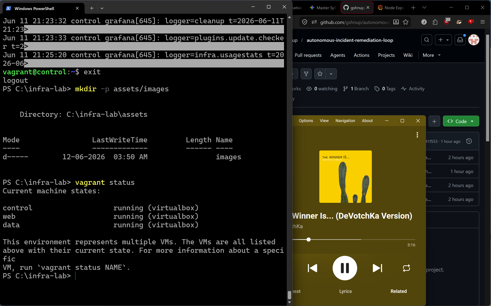
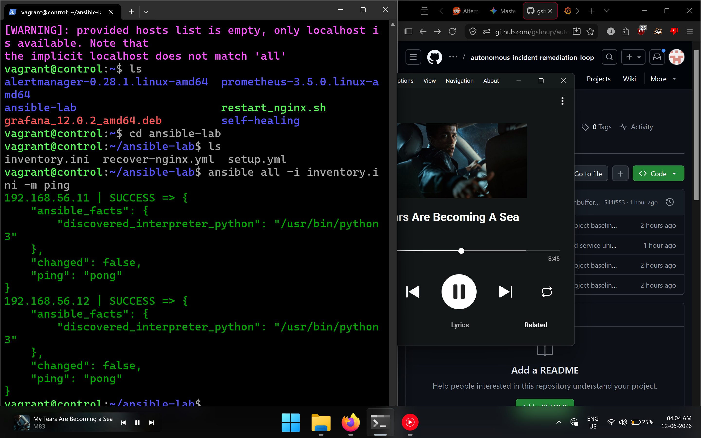
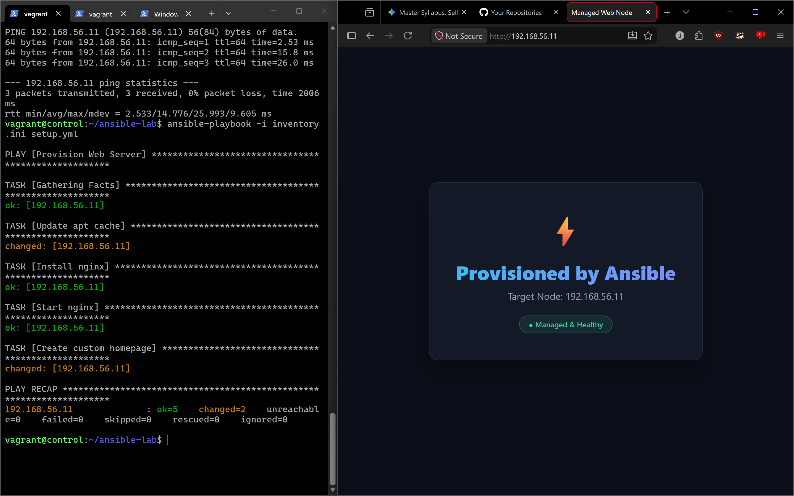
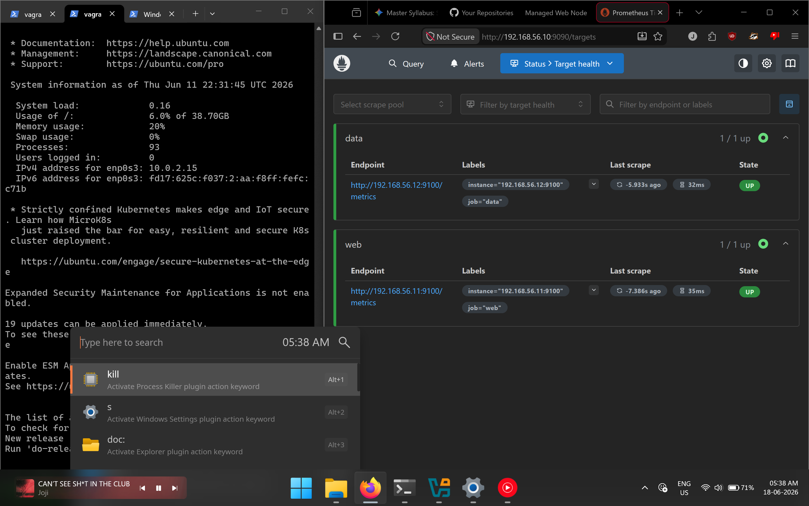
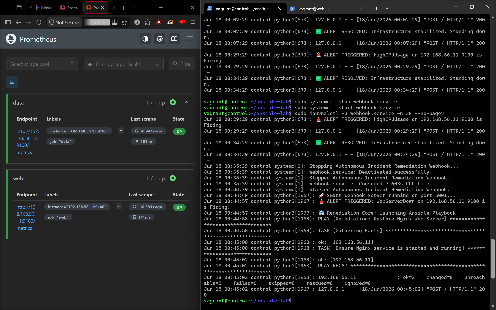

# Autonomous Incident Remediation Loop Infrastructure

An automated, self-healing multi-node infrastructure environment built locally on Ubuntu 22.04 LTS instances using Vagrant and VirtualBox. The system leverages Prometheus and Node Exporter for high-resolution telemetry collection, Prometheus Alertmanager for rule evaluation, and a custom Python Webhook listener that dynamically triggers targeted Ansible playbooks to remediate runtime service failures automatically without human intervention.

---

## 🏗️ Architecture & Network Topography

The environment simulates an enterprise-tier deployment footprint across a private host-only network subnetwork (192.168.56.0/24).

               +----------------------------------------+
               |  Control Node (192.168.56.10)          |
               |  - Ansible Engine & Webhook Listener   |
               |  - Prometheus Engine & Alertmanager    |
               |  - Grafana Visualization Platform      |
               +----------------------------------------+
                                   |
                  +----------------+----------------+
                  | (SSH Management / Webhook Pull) |
                  v                                 v
+-----------------------------------+     +-----------------------------------+
| Web Node (192.168.56.11)          |     | Data Node (192.168.56.12)         |
| - Nginx Reverse Proxy / App       |     | - Backend Telemetry Footprint     |
| - Node Exporter Daemon (Port 9100)|     | - Node Exporter Daemon (Port 9100)|
+-----------------------------------+     +-----------------------------------+

### End-to-End Remediation Flow Loop
1. Outage Event: A critical daemon or service (e.g., Nginx) fails on the web node.
2. Metrics Ingestion: Node Exporter observes the failure; Prometheus scrapes metrics every 5 seconds and evaluates alert thresholds (up{job="web"} == 0).
3. Alert Dispatch: Prometheus routes a firing state alert notification payload to Alertmanager.
4. Webhook Trigger: Alertmanager dispatches a structured HTTP POST JSON payload to the background Python Webhook service on the control node.
5. Automated Recovery: The Python service identifies the target node/service and safely executes the matching Ansible remediation playbook via local orchestration paths.
6. Self-Healing Verification: The service recovers, metrics return to normal parameters, and the firing alert transitions back to inactive.

---

## 🛠️ Project Provisioning Lifecycle

### Phase 1: Virtualization & Infrastructure Layer
Multi-node topology management is standardized via code. Running "vagrant up" parses the structured Vagrantfile, initializing configuration baselines, static IPs, hardware boundaries, and automated public-key distribution configurations.

Command to verify running virtual machines:
vagrant status

### Phase 2: Orchestration & Configuration Management via Ansible
Ansible executes task automation across inventory nodes without relying on thick target agents. Initial system verification checks routing and operational validation endpoints via automated task sheets.

Command to check multi-node connectivity:
ansible all -i inventory.ini -m ping

Upon processing the automated deployment baseline sheets, target web daemons resolve to standard response states:

### Phase 3: Telemetry Collection & Observability Matrix
System health performance parameters are scraped via low-overhead collector endpoints (Node Exporter).

* Prometheus Targets Dashboard: Tracks metrics ingestion across endpoints.
  

* Grafana Performance Reporting Engine: Renders live system resource indexes and performance curves.
  

### Phase 4: Validating the Self-Healing Remediation Loop
To test real-world platform resilience, a service failure is simulated on the target node:

# Simulating an infrastructure outage event on the web node
sudo systemctl stop nginx

Prometheus evaluates rule boundaries (alert.rules.yml) and shifts the WebServerDown state registry into active execution:

The custom background Python service traps the webhook payload, parses the outage event parameters, and runs remediation playbooks directly inside the runtime stack:

Command to inspect automated webhook execution logs:
sudo journalctl -u webhook.service -n 20 --no-pager

---

## 📋 Technology Stacking Blueprint
* Virtualization Layer: Vagrant 2.X / VirtualBox Provider Hypervisor
* Operating System Base: Ubuntu 22.04 LTS (Jammy Jellyfish)
* Configuration Management Engine: Ansible Core
* Telemetry & Metrics Ingestion: Prometheus v3.X / Node Exporter
* Alert Routing Dashboard: Prometheus Alertmanager
* Automation Automation Framework: Python Webhook Engine + systemd service integration
* Visualization Interface UI: Grafana Labs Visualizations

---