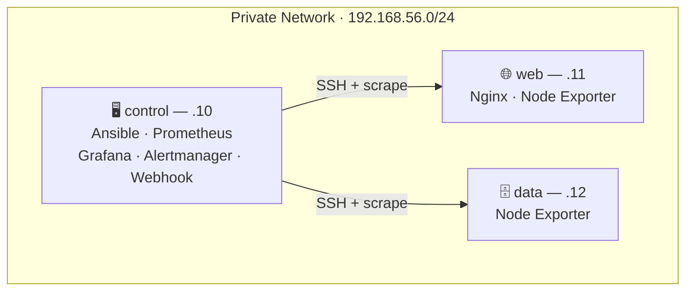
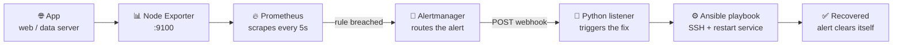
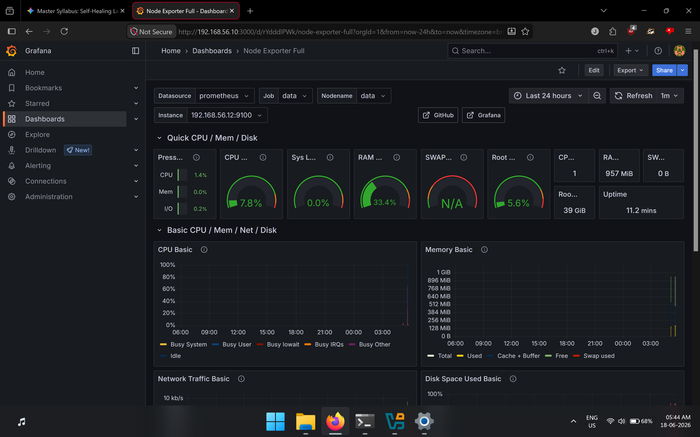
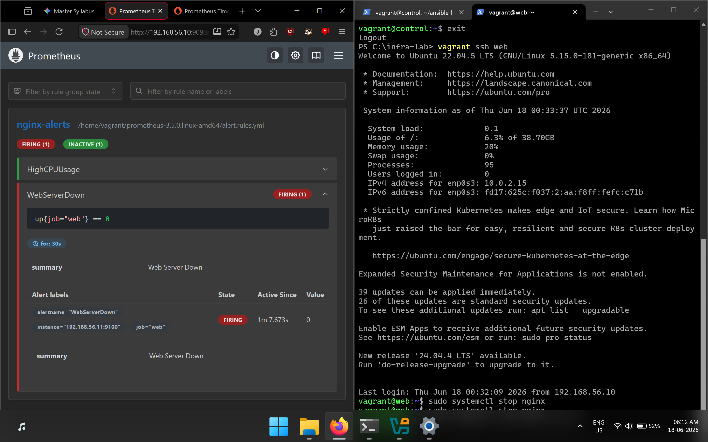

<div align="center">

# 🩺 Self-Healing Infrastructure Lab

### *Autonomous Incident Remediation Loop*

**A 3-node Linux lab that watches itself, catches its own failures, and fixes them — without a human ever touching a terminal.**


</div>

---

## 📋 Table of Contents
- [Overview](#-overview)
- [Architecture](#-architecture)
- [Tech Stack](#-tech-stack)
- [Repository Structure](#-repository-structure)
- [Quick Start](#-quick-start)
- [Build Phases](#-build-phases)
- [Alert Rules](#-alert-rules)
- [Screenshots](#-screenshots)
- [Project Status](#-project-status)
- [What This Demonstrates](#-what-this-demonstrates)
- [Future Improvements](#-future-improvements)
- [Author](#-author)
- [License](#-license)

---

## 📖 Overview

This project builds a small-scale replica of real production infrastructure — entirely on a single laptop. Three Ubuntu VMs talk to each other over a private network. One node watches the other two. When something breaks, the system detects it and fixes it without a human in the loop.

> **In plain English:** picture a web server crashing at 3 AM. Normally someone gets paged, wakes up, SSHes in, and restarts it by hand. This lab is the system that catches the crash and restarts it itself — nobody wakes up.

---

## 🏗️ Architecture

Three Ubuntu 22.04 VMs run in VirtualBox on a private network (`192.168.56.0/24`):

| Node | IP | Role | Services |
|---|---|---|---|
| `control` | `192.168.56.10` | Brain — monitors + remediates | Ansible, Prometheus, Grafana, Alertmanager, Webhook |
| `web` | `192.168.56.11` | Target — serves traffic | Nginx, Node Exporter |
| `data` | `192.168.56.12` | Target — backend tier | Node Exporter |



### The Full Pipeline



---

## 🧰 Tech Stack

| Layer | Tool | Role |
|---|---|---|
| IaC / Provisioning | **Vagrant + VirtualBox** | Spins up 3× Ubuntu 22.04 VMs from one declarative `Vagrantfile` |
| Config Management | **Ansible** | SSHes into nodes, installs services, runs the remediation playbook |
| Metrics | **Prometheus + Node Exporter** | Scrapes CPU / memory / disk / network every 5s on `:9100` |
| Visualization | **Grafana** | Live dashboards on top of Prometheus data, `:3000` |
| Alerting | **Alertmanager** | Evaluates fired rules, routes them to the webhook receiver, `:9093` (default) |
| Remediation | **Python webhook + Ansible** | Receives the alert POST, runs the playbook that fixes the node |
| Process Supervision | **systemd** | Keeps the webhook listener alive as `webhook.service` |
| Host OS | **Ubuntu 22.04** | OS for all 3 VMs |

---

## 📂 Repository Structure

Clean separation between infrastructure, automation, and monitoring config:

```
self-healing-infrastructure-lab/
├── Vagrantfile
├── ansible/
│   ├── inventory.ini
│   └── playbook.yml
├── prometheus/
│   ├── prometheus.yml
│   └── alert.rules.yml
├── alertmanager/
│   └── alertmanager.yml
├── webhook/
│   ├── webhook_listener.py
│   └── webhook.service
├── screenshots/
│   ├── vagrant_status.png
│   ├── ansible_ping.png
│   ├── nginx_welcome.png
│   ├── prometheus_targets.png
│   ├── grafana_dashboard.png
│   ├── prometheus_alert.png
│   └── recovery_logs.png
├── LICENSE
└── README.md
```

---

## ⚙️ Quick Start

### Prerequisites
- [VirtualBox](https://www.virtualbox.org/) 7.x
- [Vagrant](https://www.vagrantup.com/) 2.4+
- ~8 GB free RAM (3 VMs running concurrently)
- Ansible 2.1x (on host, or bootstrapped onto `control`)

### Spin it up

```bash
# 1. Clone the repo and move in
git clone <your-repo-url> self-healing-infrastructure-lab
cd self-healing-infrastructure-lab

# 2. Bring up all 3 VMs defined in the Vagrantfile
vagrant up

# 3. Confirm all 3 nodes are running
vagrant status

# 4. Confirm Ansible can reach web + data over SSH
ansible all -i ansible/inventory.ini -m ping

# 5. Provision Nginx + Node Exporter on the managed nodes
ansible-playbook -i ansible/inventory.ini ansible/playbook.yml

# 6. Start the observability + remediation stack on control
ssh vagrant@192.168.56.10
sudo systemctl start prometheus grafana-server alertmanager webhook

# 7. Verify the stack is alive
#    Prometheus targets → http://192.168.56.10:9090/targets
#    Grafana dashboard  → http://192.168.56.10:3000

# 8. Break something on purpose
ssh vagrant@192.168.56.11
sudo systemctl stop nginx
# Prometheus fires WebServerDown after 30s → Alertmanager → webhook → Ansible restarts nginx

# 9. Watch it heal itself
sudo journalctl -u webhook.service -n 20 --no-pager
```

---

## 🛠️ Build Phases

### Phase 1 — Infrastructure as Code
Three VMs defined in a single `Vagrantfile` instead of manually clicking through VirtualBox. One command creates all three.

```ruby
Vagrant.configure("2") do |config|
  config.vm.define "control" do |m|
    m.vm.network "private_network", ip: "192.168.56.10"
  end
  config.vm.define "web" do |m|
    m.vm.network "private_network", ip: "192.168.56.11"
  end
  config.vm.define "data" do |m|
    m.vm.network "private_network", ip: "192.168.56.12"
  end
end
```

### Phase 2 — Provisioning with Ansible
Ansible lives on `control` and SSH-keys into `web` + `data` — no manual logins, no typed passwords.

```ini
[web]
192.168.56.11

[data]
192.168.56.12
```

Nginx gets pushed to `web` via the playbook and verified live at `http://192.168.56.11`.

### Phase 3 — Monitoring Setup
Node Exporter exposes OS-level metrics (CPU, memory, disk, network) on every target. Prometheus scrapes them every 5 seconds. Grafana turns that into dashboards.

```yaml
global:
  scrape_interval: 5s

scrape_configs:
  - job_name: 'web'
    static_configs:
      - targets: ['192.168.56.11:9100']
  - job_name: 'data'
    static_configs:
      - targets: ['192.168.56.12:9100']
```

### Phase 4 — Self-Healing Automation & Alerting
The core of the project. Alertmanager intercepts a firing alert and POSTs it to a Python webhook listener, which runs an Ansible playbook to fix the node — no human in the loop.

```yaml
groups:
  - name: nginx-alerts
    rules:
    - alert: WebServerDown
      expr: up{job="web"} == 0
      for: 30s
      labels:
        severity: critical
      annotations:
        summary: "Web Server Down"
```

> **Validated under failure:** killing Nginx on `web` triggers the full loop — alert fires, webhook receives it, Ansible restarts the service, and the alert clears automatically within seconds. Zero manual terminal interaction.

---

## 🚨 Alert Rules

| Alert | Trigger Condition | Production Meaning |
|---|---|---|
| `HighCPUUsage` | CPU idle % drops below threshold | Node is CPU-throttled or overloaded |
| `WebServerDown` | `up{job="web"} == 0` for `30s` | Target service/daemon has crashed or stopped responding |

---


## 📸 Screenshots

<table width="100%">
  <tr>
    <td width="50%" valign="top">
      <strong>1 · VM Provisioning</strong><br>
      <code>vagrant status</code> — all 3 nodes running<br>
      
    </td>
    <td width="50%" valign="top">
      <strong>2 · Ansible Connectivity</strong><br>
      <code>ansible -m ping</code> — passwordless SSH confirmed<br>
      
    </td>
  </tr>
  <tr>
    <td width="50%" valign="top">
      <strong>3 · Nginx Live</strong><br>
      Deployed via playbook, served at .11<br>
      
    </td>
    <td width="50%" valign="top">
      <strong>4 · Prometheus Targets</strong><br>
      Both nodes reporting UP<br>
      
    </td>
  </tr>
  <tr>
    <td width="50%" valign="top">
      <strong>5 · Grafana Dashboard</strong><br>
      Live CPU / mem / disk telemetry<br>
      
    </td>
    <td width="50%" valign="top">
      <strong>6 · Alert Firing</strong><br>
      <code>WebServerDown</code> triggered on forced outage<br>
      
    </td>
  </tr>
  <tr>
    <td width="50%" valign="top">
      <strong>7 · Auto-Recovery Logs</strong><br>
      Webhook → Ansible fix, captured live in journalctl<br>
      
    </td>
    <td width="50%"></td>
  </tr>
</table>


## ✅ Project Status

- [x] Multi-VM infrastructure created with `Vagrantfile`
- [x] Private network configured between all 3 nodes
- [x] SSH key trust established (`control → web`, `control → data`)
- [x] Ansible inventory + playbook written and idempotent
- [x] Nginx deployed and verified live on the web node
- [x] Prometheus + Node Exporter scrape targets configured and healthy
- [x] Grafana dashboards rendering live metrics
- [x] Alertmanager → webhook → Ansible auto-remediation validated end-to-end

*Last validated: June 2026 — loop confirmed healing a forced outage with zero manual intervention.*

---

## 🎯 What This Demonstrates

- **Infrastructure as Code** — the entire environment is reproducible from one `vagrant up`, zero manual VirtualBox clicking
- **Configuration management** — idempotent Ansible playbooks over key-based SSH, no plaintext passwords anywhere
- **Observability** — a real metrics pipeline: Node Exporter → Prometheus → Grafana
- **Alerting** — threshold-based rules with severity labels and routing, not just a log line
- **Closed-loop automation** — the alert *triggers a fix*, it doesn't just notify a human
- **Service reliability** — the webhook listener runs as a supervised `systemd` unit, not a foreground script
- **Tested under real failure** — recovery was proven by forcing actual outages, not just reading the code

---

## 🔭 Future Improvements

- [ ] Push alert + recovery events to Slack/Discord for real-time visibility
- [ ] Extend remediation beyond service restarts — disk pressure, memory leaks, cert expiry
- [ ] Add `ansible-lint` + `promtool check rules` to a CI pipeline
- [ ] Provision Grafana dashboards as code instead of manual setup
- [ ] Add a max-retry / circuit breaker guard to stop restart loops on unrecoverable failures
- [ ] Port the lab from local VirtualBox VMs to AWS via Terraform for cloud-realistic testing
- [ ] Containerize the webhook listener


## 📄 License

Licensed under the [MIT License](LICENSE).

<div align="center">


</div>